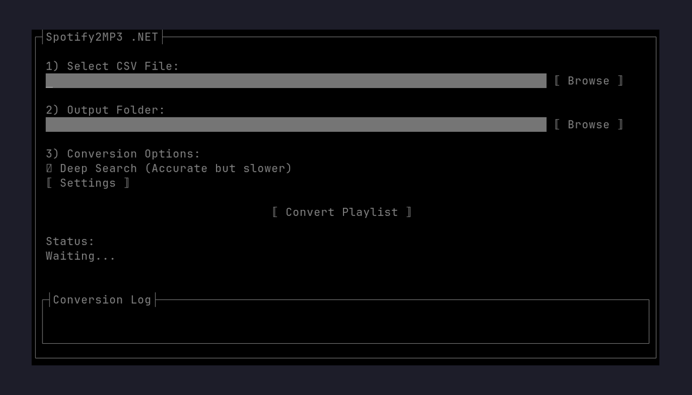
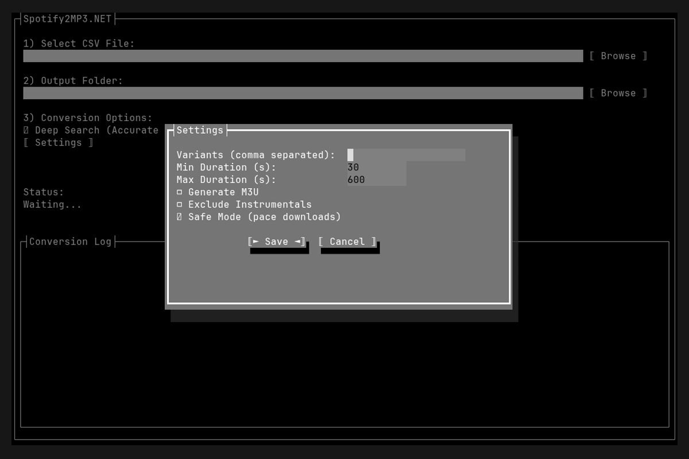

# Spotify2MP3.NET

A terminal user interface (TUI) application that converts Spotify playlists and albums to local MP3 files. It accepts a Spotify URL or a CSV export, searches for each track on YouTube, downloads the audio, and embeds metadata.

This project is a complete rewrite of [Spotify2MP3](https://github.com/angall1/Spotify2MP3) built with C# / .NET 10 and [Terminal.Gui](https://github.com/gui-cs/Terminal.Gui).

## Screenshots

### Main Window



### Settings Dialog



## Prerequisites

- [.NET 10 SDK](https://dotnet.microsoft.com/download)
- [yt-dlp](https://github.com/yt-dlp/yt-dlp) — must be on `PATH`
- [FFmpeg](https://ffmpeg.org/) — required by yt-dlp for MP3 extraction

## Build & Run

```bash
# Clone the repository
git clone git@github.com:pacyfist/Spotify2MP3.NET.git
cd Spotify2MP3.NET

# Run
dotnet run --project Spotify2MP3.NET/

# Or build first
dotnet build
cd Spotify2MP3.NET/bin/Debug/net10.0/

# Linux / macOS
./Spotify2MP3.NET

# Windows
./Spotify2MP3.NET.exe
```

### Command-line options

| Flag                                  | Description                                                                                                                                |
| ------------------------------------- | ------------------------------------------------------------------------------------------------------------------------------------------ |
| `--source <path or URL>`              | CSV file path, Spotify playlist URL, or Spotify album URL. Pre-fills the source field in the TUI; in headless mode, this is the input.     |
| `--folder <path>`                     | Output folder. Pre-fills the output field in the TUI; in headless mode, this is the destination root.                                      |
| `--headless`                          | Run without the TUI: logs to stdout, exit code reflects success. Requires both `--source` and `--folder`.                                  |
| `--deep-search <true\|false>`         | Toggle Deep Search for the session. Default `true`.                                                                                        |
| `--variants <csv>`                    | Comma-separated search variants (e.g. `remix,acoustic`). Empty string clears the list. Overrides the saved config for the session.         |
| `--exclude <csv>`                     | Comma-separated words to exclude from YouTube titles (e.g. `instrumental,karaoke`). Empty string disables filtering. Default: `instrumental`. |
| `--duration-min <seconds>`            | Reject videos shorter than this many seconds. Overrides the saved config for the session.                                                  |
| `--duration-max <seconds>`            | Reject videos longer than this many seconds. Overrides the saved config for the session.                                                   |
| `--m3u <true\|false>`                 | Generate `playlist.m3u` alongside the MP3s. Overrides the saved config for the session.                                                    |
| `--safe-mode <true\|false>`           | Pace downloads to avoid YouTube throttling (see Safe Mode below). Overrides the saved config for the session.                              |
| `--cover-art <true\|false>`           | Embed Spotify album art instead of the YouTube thumbnail. Overrides the saved config for the session.                                      |

CLI overrides apply to the current run only; they don't write to `config.json`. Open the **Settings** dialog and click **Save** to persist them.

```bash
# Open the TUI with the source field pre-filled and the output field set to /music
dotnet run --project Spotify2MP3.NET/ -- --source ~/playlists/mix.csv --folder /music

# Run headlessly — no UI, logs to stdout, exit code reflects success
dotnet run --project Spotify2MP3.NET/ -- --headless \
    --source https://open.spotify.com/playlist/37i9dQZF1DXcBWIGoYBM5M \
    --folder /music

# Headless run with extra overrides: faster (no deep search), with cover art and an M3U
dotnet run --project Spotify2MP3.NET/ -- --headless \
    --source ~/playlists/mix.csv --folder /music \
    --deep-search false --cover-art true --m3u true \
    --duration-min 60 --duration-max 480
```

Headless exit codes: `0` all tracks downloaded, `1` partial failure (some tracks not found), `2` fatal error (bad input, IO failure, etc.), `130` cancelled with Ctrl+C.

## Quick Start

1. **Provide a source** — paste a Spotify URL into the first field, or click **Browse** to pick a CSV export
2. **Pick an output folder** with the second **Browse** button
3. **Toggle Deep Search** for more accurate YouTube matching (slower, but better results)
4. **Adjust Settings** if needed (variants, duration filters, M3U, cover art, safe mode)
5. **Click Convert Playlist** and watch progress in the log window

Downloaded MP3s are saved to a subfolder named after the playlist or album, with embedded ID3 tags (title, artist, album, track number).

## Features

### Spotify URL input

Paste any of the following directly into the source field:

- Playlist URL: `https://open.spotify.com/playlist/{id}`
- Album URL: `https://open.spotify.com/album/{id}`
- Spotify URI: `spotify:playlist:{id}` or `spotify:album:{id}`
- Bare 22-character ID (treated as a playlist ID)

The app fetches the track list from Spotify's public embed page (`open.spotify.com/embed/...`), which requires no developer account or login. Album tracks automatically pick up the album name for ID3 tagging.

> **Note:** This uses an undocumented Spotify endpoint and is intended for personal use only. The embed page typically returns up to ~100 tracks, so very large playlists may be truncated — fall back to the CSV path for those.

### CSV input

If you'd rather use a CSV export (e.g. via [Exportify](https://exportify.net/)), the app expects these columns:

```csv
Track Name,Artist Name(s),Album Name,Duration (ms)
```

`Duration (ms)` is optional but improves Deep Search match quality. Header aliases like `Track name`, `Artist name`, and `Album` are also accepted.

### Deep Search

When the **Deep Search** checkbox is on (default), the app does more than take the first YouTube result:

1. It inspects the top result and accepts it only if the title, the uploader, and the duration all match what Spotify reported (within ±10 s).
2. If that fails, it scores the top three results — preferring titles that start with the track name, uploader names containing the artist, durations close to the Spotify length, and (when relevant) titles that include the requested variant. `#shorts` are excluded.
3. If both passes fail, it falls back to a plain `ytsearch1:` download.

Turn Deep Search off for fastest runs; leave it on for the best chance of getting the right version.

### Settings

Open the **Settings** dialog (`Alt+S` or click the button) to configure:

| Setting               | Default        | Description                                                                  |
| --------------------- | -------------- | ---------------------------------------------------------------------------- |
| Variants              | _(empty)_      | Comma-separated search variants (e.g. `remix,acoustic`)                      |
| Exclude               | `instrumental` | Comma-separated words to reject in YouTube titles (e.g. `instrumental,karaoke`) |
| Min Duration          | 30s            | Reject videos shorter than this                                              |
| Max Duration          | 600s           | Reject videos longer than this                                               |
| Generate M3U          | On             | Write a `playlist.m3u` file alongside the MP3s                               |
| Safe Mode             | Off            | Pace downloads to avoid YouTube throttling (see below)                       |
| Use Spotify cover Art | Off            | Embed real album cover from Spotify instead of YT thumb                      |

Settings persist in a `config.json` file next to the executable (`AppContext.BaseDirectory`, e.g. `/path/to/app/config.json`). The file is written only when you click **Save** in the Settings dialog. On launch the app reads it if present and silently falls back to defaults if missing or malformed. CLI overrides (`--m3u`, `--variants`, etc.) mutate the in-memory config for the session and are **not** written back.

### Variants

If you set **Variants** to `remix,acoustic`, every track is downloaded twice — once searching for `Title Artist remix`, once for `Title Artist acoustic` — into separate files. Leave it empty to download each track only once. If a track title already contains `instrumental`, an `instrumental` variant is automatically prepended (regardless of the Variants setting).

### Cover art

By default, yt-dlp embeds the YouTube video's thumbnail. Turn on **Use Spotify cover Art** to replace it with the real album cover fetched from Spotify's public endpoint:

- Album inputs use the album-level cover for every track.
- Playlist inputs resolve each track's album cover individually via `open.spotify.com/embed/track/{id}`.
- If Spotify doesn't return an image, the YT thumbnail embedded by yt-dlp is kept as a fallback.

### Safe Mode

Safe Mode adjusts download pacing based on playlist size to avoid YouTube rate-limiting:

| Tier       | Playlist Size | Delay Between Tracks | Rate Limit |
| ---------- | ------------- | -------------------- | ---------- |
| Normal     | < 250 tracks  | 3s                   | 5 MB/s     |
| Large      | 250–499       | 8s                   | 2 MB/s     |
| Aggressive | 500+          | 15s                  | 1 MB/s     |

Tracks that already exist on disk are skipped without delay. The selected tier is logged at the start of each run.

### Resume on re-run

The app checks each output filename before downloading. If `Artist - Track.mp3` already exists in the output folder, it's logged as `[OK] Already exists` and skipped — making re-runs cheap and safe.

### Conversion log & progress

While a run is active, the bottom panel of the main window shows a live log (errors highlighted), the status label shows the current track, and the progress bar fills as tracks complete. Every line is also written to `conversion.log` in the output folder.

### Completion summary

When a run finishes, a summary dialog shows the total tracks processed, how many were downloaded, and lists any that failed (track name and artist). Failed tracks are also reported in the log.

### Output layout

```
output_folder/
  playlist_or_album_name/
    Artist - Track.mp3
    Artist - Track 2.mp3
    playlist.m3u        # if "Generate M3U" is on
    conversion.log
```

Filenames are sanitized by stripping non-alphanumeric characters from the artist and title.

### Keyboard shortcuts

- `Tab` / `Shift+Tab` — navigate between controls
- `Enter` / `Space` — activate buttons and checkboxes
- `Alt+B` / `Alt+O` — focus the CSV/URL **Browse** / output folder **Browse** buttons
- `Alt+D` — toggle **Deep Search**
- `Alt+S` — open **Settings**
- `Alt+C` — **Convert Playlist**
- `Alt+T` — **Stop** (cancel the active conversion)
- In the Settings dialog: `Alt+M` (M3U), `Alt+F` (safe mode), `Alt+A` (cover art), `Alt+S` save, `Alt+C` cancel
- `Esc` — quit the application

## Running Tests

```bash
dotnet test
```

## License

This project is licensed under the [GNU Affero General Public License v3.0](LICENSE).
